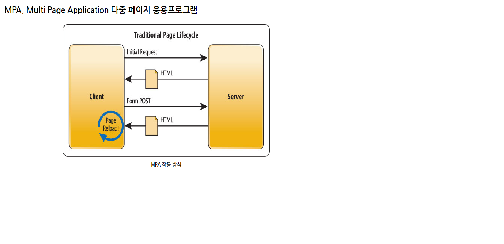
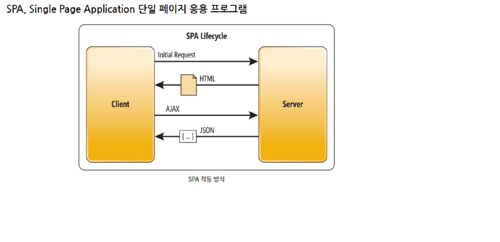

# week5 개념 과제  
      
## 클래스형 컴포넌트 vs 함수형 컴포넌트  
    
클래스형 컴포넌트 : state,lifeCycle 관련 기능사용이 가능하며, 메모리 자원을 함수형 컴포넌트보다 조금 더 사용한다고 한다.  
함수형 컴포넌트: state,lifeCycle 관련 기능사용이 불가능하여 HOOKS를 통해 해결하였으며, 메모리 자원을 함수형 컴포넌트 덜 사용한다는 특징이 있다.  
함수형 컴포넌트를 사용하면,  
1. 리렌더링 될 때의 값을 유지한다.  
2. 함수형 컴포넌트는 props에 따른 랜더링 결과를 보장받는다.  
3. 매개변수로 받는 props의 구조 분해 할당을 활용하여 가독성을 보장받을 수 있다.  
4. 함수의 모든 장점을 이용할 수 있으며 메모리 사용량이 적다.  
5. 따라서 함수형 컴포넌트의 사용이 권장된다.  
  
## 렌더링? 마운트?  
렌더링이란 리액트를 구성하는 코드의 요소가 가시적으로 그려지는 것을 말하며,  마운트는 DOM이 생성되고 웹 브라우저상에 처음으로 나타나는 과정을 말한다.  

렌더링은  
1.props가 변경되었을 때  
2.state가 변경되었을 때  
3.부모 컴포넌트가 렌더링 되었을 때 일어나며  

마운트는 컴포넌트가 브라우저에 나타날 때 일어난다.

# week4 개념 과제    

## SPA? MPA?  

  

MPA는 다중 페이지 응용프로그램으로, client와 server의 통신이 완료되면 페이지가 다시 불러와지면서 화면이 깜빡거리게 된다.  
SEO 친화적   
  

SPA는 단일 페이지 응용 프로그램으로, 하나의 HTML 파일을 가지고 나머지는 js를 이용해서 동적으로 화면을 구성한다    
MPA와 다르게 변경되지 않는 부분은 그대로 두고 변경되는 부분만 다시 렌더링 한다는 장점이 있다(새로고침이 되지 않고 변경) SEO에 취약  

## Virutal DOM?  

  

VirtualDom은 Dom이 생성되기 전, 이전 상태 값과 수정사항을 비교하여 달라진 부분만  
DOM에게 한 번에 전달하여 딱 한 번만 렌더링을 진행한다.  

'직접 DOM에 접근하는 것은 지양해야 한다' 라는 마인드셋으로 브라우저에 과부하를 방지하는 개념으로, 수정사항이 생긴 부분에만 접근하여 변경하고 결과물을 실제 DOM에 전달한다.

## 브라우저 렌더링 과정  

1. 주소창에 특정 주소를 입력한다  

2. 해당 주소의 서버를 찾아가고, DNS가 실제 서버가 있는 곳으로 연결해줌  

3. 서버 대부분의 기본 설정이 index.html로 되어있으므로 이 파일을 서버에서 클라이언트 쪽으로 보내준다.  

4. 해당 파일을 받은 브라우저는 텍스트로 이루어진 이 파일을 파싱하면서 DOM 트리를 만들어 나감.  

5. 읽다가 중간에 link tag를 만나서 css 요청이 발생하면 요청과 응답 과정을 거쳐 css를 파싱  

6. css 파싱이 종료 되면 잠시 중단 되었던 html을 다시 읽고 DOM TRE를 완성 시킴  

7. 완성된 DOM TREE, CSSOM TREE를 합쳐 RENDER TREE를 만들게 됨  

8. HTML 파서는 파싱을 하다가 SCRIPT TAG를 만나면 JS 코드를 실행하기 위해 파싱을 중단  

9. 제어 권한을 JS ENGINE에게 넘기고, JS 코드 또는 파일을 로드해서 파싱하고 실행한다.  

reference From 'https://patrick-f.tistory.com/9'

# 리액트 프로젝트, 자기 소개 페이지  

리액트가 익숙치 않아서 아주 형편 없다 열심히하자.
